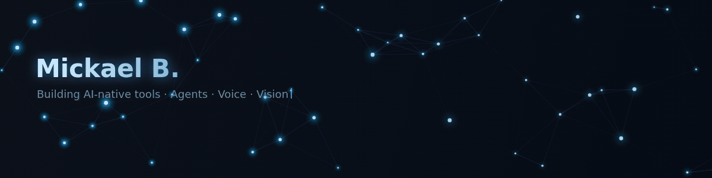

  

  

 

I build **AI-native tools** — autonomous agents, voice interfaces, image generation CLIs, and the developer infrastructure to run them all.

---

### 🔨 What I'm building

| | Project | Description |
|:--|:--------|:------------|
| 🤖 | **[Lyra](https://github.com/Roxabi/lyra)** | Personal AI agent — Telegram + Discord, hub-and-spoke architecture |
| 🎙️ | **[VoiceCLI](https://github.com/Roxabi/voiceCLI)** | Unified TTS/STT CLI — Qwen3-TTS, Chatterbox, Whisper |
| 🖼️ | **[ImageCLI](https://github.com/Roxabi/imageCLI)** | Local image generation — FLUX.1-dev, SD3.5 |
| 💰 | **[ryvo](https://github.com/Roxabi/ryvo)** | AI-native treasury platform for French scaleups |
| 🔌 | **[roxabi-plugins](https://github.com/Roxabi/roxabi-plugins)** | Open-source Claude Code plugins — context engineering for teams |

---

### 🛠 Stack

---

  

 

  🇫🇷 France · <a href="https://github.com/Roxabi">Roxabi org</a>

